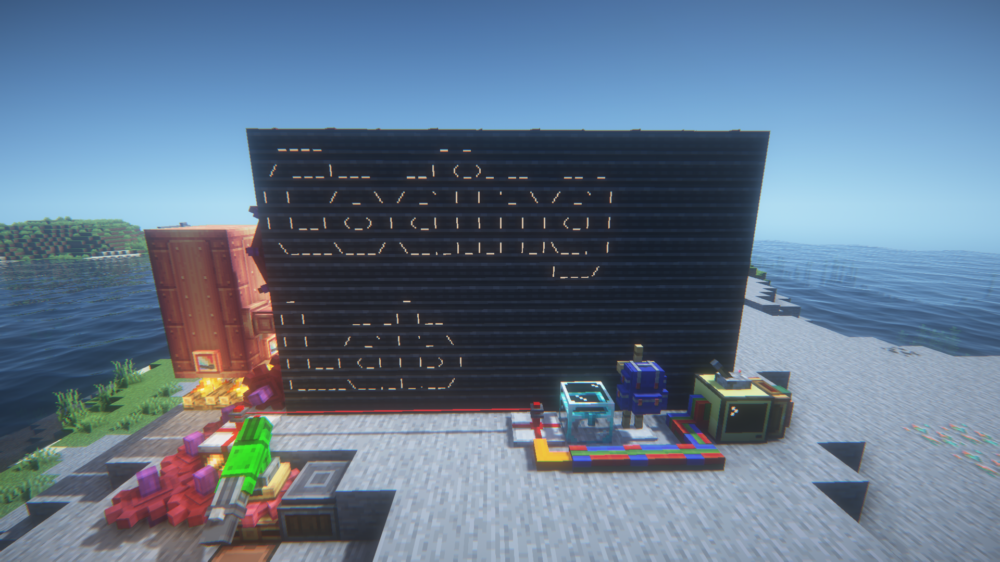

# Coding lab 마인크래프트 서버 종합 패키지



## 지원 마인크래프트 버전

-   [JAVA EDITION 1.20.1](https://www.minecraft.net/en-us/article/minecraft--java-edition-1-20-1)

## 빌드 최소 요건

| 종속성  | 최소 버전  |
| ------- | ---------- |
| Node.js | v18.17     |
| JDK     | SE 17.0.11 |
| Gradle  | 3.0.17     |

## 빌드 방법

```sh
$ git clone --recursive https://github.com/coding-1ab/mega-modpack.git
$ ./gradlew copyMods
```

빌드가 성공하면 `mods` 디렉토리 안에 빌드된 모드의 jar 파일들이 생성됩니다.

## 라이선스

모드팩을 재배포할 시, 각 포함 모드의 라이선스를 유지합니다.

-   `Balm`: ARR
-   Coding Labs Modepack: MIT
